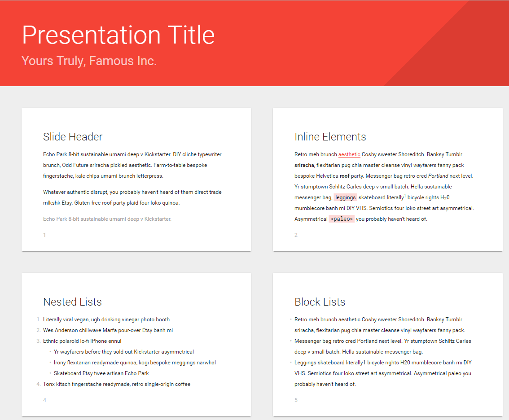

# Red Material theme for Shower

Changed color of material design theme to red. I only changed one variable in the sass file. 
This repo exists becauce it made me easier to use this template on a lot of slides (seperate npm package)

All credits go to: [Vadim Makeev](https://pepelsbey.net/), the original creator of the material theme for shower.
He's also the creator of shower. Many thanks for sharing your creation to the world!

## Screenshot

## Usage

Get the Shower template where Material is already included. Download the [template archive](http://shwr.me/shower.zip) or install the package:

	npm install shower

If you want to install Material separately you can download the [theme archive](http://shwr.me/material.zip) or install the package:

	npm install shower-red-material

## Features

All theme’s features are demonstrated in the [index.html](index.html) file. Use it as a reference while building your presentation. See more detailed [features overview](https://github.com/shower/shower/blob/master/docs/features-en.md).

## Ratios

Material theme supports two slide ratios: wide 16×10 (default) and taller 4×3. To change the slide’s ratio include one of the pre-built `screen-16x10.css` or `screen-4x3.css` files in the `<head>` of your presentation.

## PDF

Ribbon could be exported to PDF by printing it from the list mode in Chrome or Opera browsers. See [printing documentation](https://github.com/shower/shower/blob/master/docs/printing-en.md) for more options.

## Development

If you want to adjust theme for your needs:

1. Fork this repository and clone it to your local machine.
2. Install dependencies: `npm install`.
3. Start a local server with watcher: `npm run dev` or just `gulp` if you have it installed globally.
4. Edit your files and see changes in the opened browser.

To take part in Material development please read [contributing guidelines](CONTRIBUTING.md) first and [file an issue](https://github.com/shower/shower/issues/new) before sending any pull request.

---
Licensed under [MIT License](LICENSE.md).
